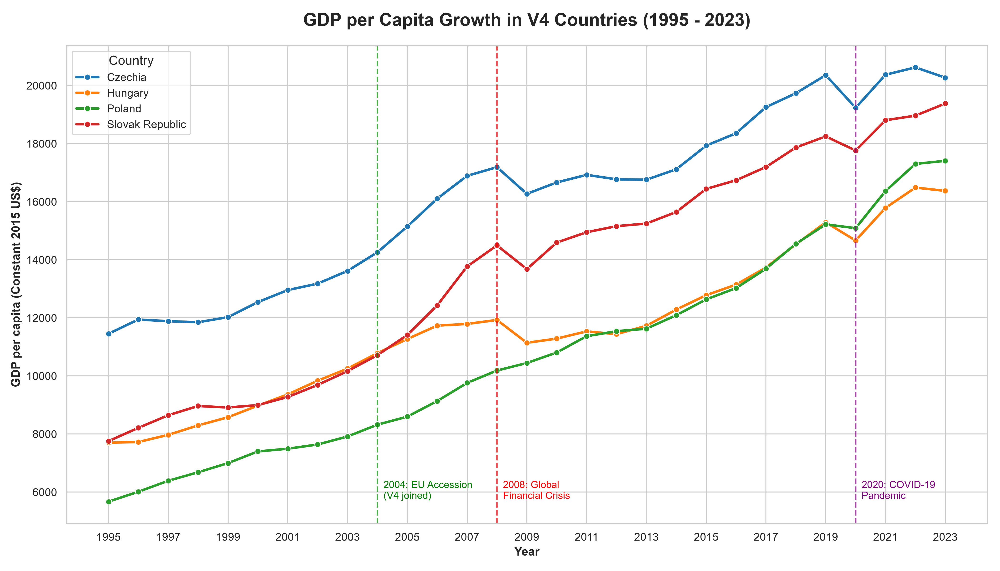
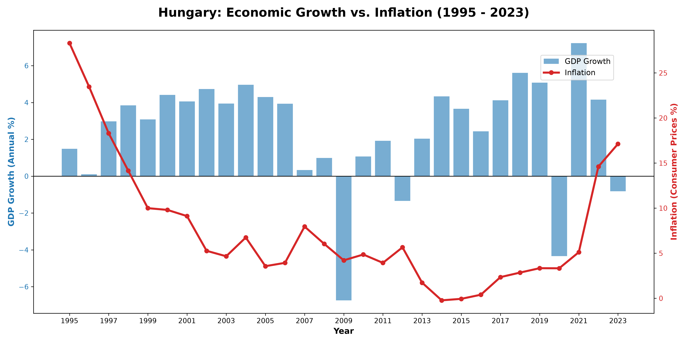
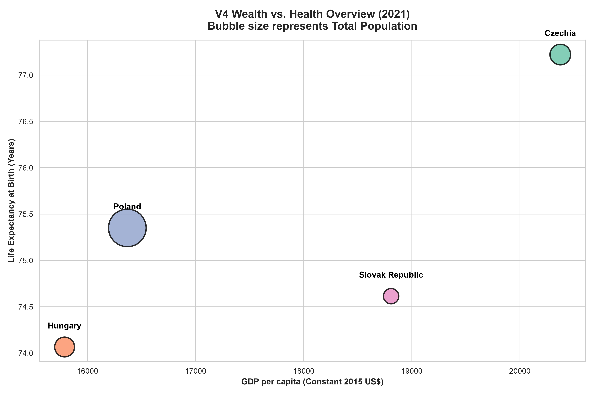

# 📊 Macroeconomic Convergence and Social Development in the V4 Countries
**A Data Analytics Portfolio Project**

## 🎯 Executive Summary
This project analyzes the economic and social trajectory of the Visegrád Group (V4: Hungary, Czechia, Slovakia, and Poland) over the past three decades. Using data from the World Bank's World Development Indicators (WDI), this analysis seeks to answer a core question: *What macroeconomic, technological, and social factors drove the economic catch-up of the V4 region following their 2004 EU accession?*

Through data wrangling, exploratory data analysis (EDA), and advanced visualization techniques, this repository translates over 140,000 rows of raw data into actionable economic insights.

## 🛠️ Data Wrangling & Methodology
*   **Source:** World Bank (WDI) raw data extract.
*   **Data Cleaning (Python/Pandas):** 
    *   Transformed wide-format time-series data into a long-format analytical structure using `pd.melt()`.
    *   Cleaned missing values, parsed years, and built a relational pivot table structure.
    *   Filtered a massive dataset of 1,500+ metrics down to **30 critical macroeconomic and social indicators** (e.g., GDP, Inflation, FDI, Life Expectancy, R&D Expenditure) for targeted analysis.

---

## 📈 Visualizations & Economic Insights

### 1. Correlation Analysis: Macroeconomic & Social Indicators

> **Insight:** This heatmap visualizes the Pearson correlation coefficients between 30 key indicators. The data reveals that the digital economy drives wealth: there is a highly significant positive correlation between GDP per capita and Internet usage. Furthermore, economic growth translates directly to social well-being, as increasing GDP shows a strong negative correlation with infant mortality and poverty ratios, proving that economic convergence has successfully funded better living standards.

### 2. Historical GDP Growth and Macroeconomic Shocks

> **Insight:** This chart tracks the economic convergence of the V4. Following their integration into the EU in 2004 (green line), all four countries experienced an acceleration in wealth generation. While the 2008 Financial Crisis and the 2020 COVID-19 pandemic caused significant disruptions, the rapid recoveries demonstrate the underlying resilience of these export-oriented economies. Czechia consistently maintains the highest GDP per capita, while Poland showcases the most uninterrupted growth trajectory.

### 3. Deep Dive: Macroeconomic Cycles and Stagflation Risks in Hungary (1995-2023)

> **Insight:** Focusing locally on Hungary, this dual-axis visualization provides a timeline of macroeconomic stability by contrasting GDP Growth (bars) with Consumer Price Inflation (line). It captures the "Golden Decade" (2013–2019) characterized by robust GDP growth and remarkably low inflation. However, the Polycrisis Era (2020–2023) tells a different story: aggressive post-COVID economic rebounds collided with the 2022 energy crisis, triggering an unprecedented inflationary spike that eventually dampened economic growth, highlighting severe stagflation risks.

### 4. Multidimensional Benchmarking: The Wealth and Health Nexus (2021)

> **Insight:** This multidimensional bubble chart condenses Economic Output (X-axis), Societal Well-being (Y-axis), and Demographic Scale (Bubble size). It reveals a "Translation Gap" within the region. While Hungary and Slovakia have made significant economic strides, they lag noticeably behind Czechia in life expectancy. This proves that while the V4 countries share a similar geopolitical background, their systemic efficiency at converting generated wealth into human capital and longevity differs measurably.

---

## 💻 Technologies Used
*   **Language:** Python 3
*   **Libraries:** `pandas` (Data Manipulation), `numpy`, `matplotlib` & `seaborn` (Data Visualization)
*   **Environment:** IDLE / Jupyter Notebook

## 🚀 How to Run the Code
1. Clone the repository.
2. Ensure you have the required libraries installed: `pip install pandas numpy matplotlib seaborn openpyxl`
3. Run the individual Python scripts (e.g., `v4_gdp_trend.py`) to generate the high-resolution charts.

# 📊 Macroeconomic Convergence and Social Development in the V4 Countries
**A Data Analytics Portfolio Project**

## 🎯 Executive Summary
This project analyzes the economic and social trajectory of the Visegrád Group (V4: Hungary, Czechia, Slovakia, and Poland) over the past three decades. Using data from the World Bank's World Development Indicators (WDI), this analysis seeks to answer a core question: *What macroeconomic, technological, and social factors drove the economic catch-up of the V4 region following their 2004 EU accession?*

Through data wrangling, exploratory data analysis (EDA), and advanced visualization techniques, this repository translates over 140,000 rows of raw data into actionable economic insights.

## 🛠️ Data Wrangling & Methodology
*   **Source:** World Bank (WDI) raw data extract.
*   **Data Cleaning (Python/Pandas):** 
    *   Transformed wide-format time-series data into a long-format analytical structure using `pd.melt()`.
    *   Cleaned missing values, parsed years, and built a relational pivot table structure.
    *   Filtered a massive dataset of 1,500+ metrics down to **30 critical macroeconomic and social indicators** (e.g., GDP, Inflation, FDI, Life Expectancy, R&D Expenditure) for targeted analysis.

---

## 📈 Visualizations & Economic Insights

### 1. Correlation Analysis: Macroeconomic & Social Indicators

> **Insight:** This heatmap visualizes the Pearson correlation coefficients between 30 key indicators. The data reveals that the digital economy drives wealth: there is a highly significant positive correlation between GDP per capita and Internet usage. Furthermore, economic growth translates directly to social well-being, as increasing GDP shows a strong negative correlation with infant mortality and poverty ratios, proving that economic convergence has successfully funded better living standards.

### 2. Historical GDP Growth and Macroeconomic Shocks

> **Insight:** This chart tracks the economic convergence of the V4. Following their integration into the EU in 2004, all four countries experienced an acceleration in wealth generation. While the 2008 Financial Crisis and the 2020 COVID-19 pandemic caused significant disruptions, the rapid recoveries demonstrate the underlying resilience of these export-oriented economies. Czechia consistently maintains the highest GDP per capita, while Poland showcases the most uninterrupted growth trajectory.

### 3. Deep Dive: Macroeconomic Cycles and Stagflation Risks in Hungary (1995-2023)

> **Insight:** Focusing locally on Hungary, this dual-axis visualization provides a timeline of macroeconomic stability by contrasting GDP Growth (bars) with Consumer Price Inflation (line). It captures the "Golden Decade" (2013–2019) characterized by robust GDP growth and remarkably low inflation. However, the Polycrisis Era (2020–2023) tells a different story: aggressive post-COVID economic rebounds collided with the 2022 energy crisis, triggering an unprecedented inflationary spike that eventually dampened economic growth, highlighting severe stagflation risks.

### 4. Multidimensional Benchmarking: The Wealth and Health Nexus (2021)

> **Insight:** This multidimensional bubble chart condenses Economic Output (X-axis), Societal Well-being (Y-axis), and Demographic Scale (Bubble size). It reveals a "Translation Gap" within the region. While Hungary and Slovakia have made significant economic strides, they lag noticeably behind Czechia in life expectancy. This proves that while the V4 countries share a similar geopolitical background, their systemic efficiency at converting generated wealth into human capital and longevity differs measurably.

---

## 📊 Interactive Power BI Dashboard (Next Level Analytics)
To elevate the analysis from static reporting to an interactive data product, this project also features a comprehensive **Power BI Dashboard**. This allows stakeholders to dynamically explore the V4 macroeconomic trends:
*   **Animated Wealth vs. Health Matrix:** A scatter chart utilizing a *Play Axis* to animate the developmental trajectory of the V4 countries from 1995 to 2023, vividly showcasing the evolution of the "Translation Gap" over time.
*   **Interactive Stagflation Deep-Dive:** A dynamic dual-axis chart equipped with country-level slicers. Users can instantly switch between Hungary, Poland, Czechia, and Slovakia to compare their GDP growth vs. Inflation cycles.
*   **Dynamic GDP Milestones:** An interactive line chart featuring dynamically generated reference lines for the 2004 EU Accession, the 2008 Financial Crisis, and the 2020 COVID-19 pandemic.
*   **Advanced DAX Modeling:** Implementation of explicit DAX measures (e.g., `Avg_GDP_Per_Capita`, `Avg_Inflation`) ensuring robust performance and scalable aggregations.

*(Include a GIF or a link to the dashboard here if available)*

---

## 💻 Technologies Used
*   **Language:** Python 3
*   **Libraries:** `pandas` (Data Manipulation), `numpy`, `matplotlib` & `seaborn` (Data Visualization)
*   **BI Tool:** Power BI (Power Query, DAX Modeling, Interactive Dashboards)
*   **Environment:** IDLE / Jupyter Notebook

## 🚀 How to Run the Code
1. Clone the repository.
2. Ensure you have the required libraries installed: `pip install pandas numpy matplotlib seaborn openpyxl`
3. Run the individual Python scripts (e.g., `v4_linechart.py`) to generate the high-resolution charts.